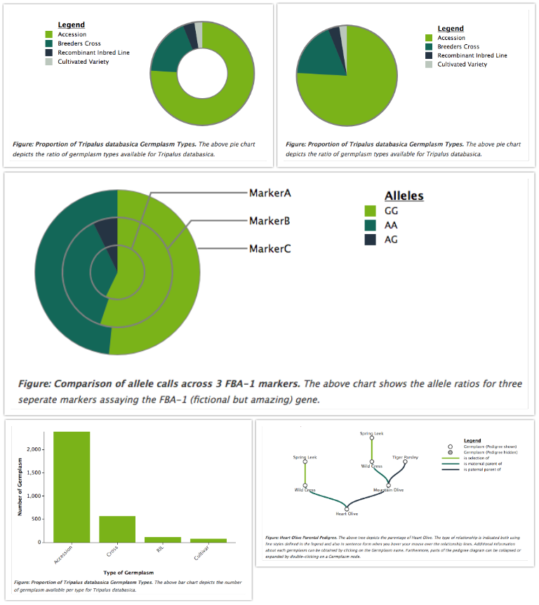

# Tripal d3.js API
Provides d3.js integration for Tripal. It provides an API for developing consistent
biological diagrams with a common configuration, as well as, providing some
common diagrams such as pie, bar, column and pedigree diagrams.

**NOTE:** This module is an API and does not provide user facing diagrams.
Rather, you would develop your own diagrams. Diagram functionality is
demonstrated at Admin » Tripal » Extension Modules » Tripal D3 Diagrams » Demo.

## STATUS: Charts are functioning and customizable. In final debugging stage.

## Installation & Setup
1. Download the [D3 v3 javascript library](http://d3js.org/) (quick check, you should have a libraries/d3/d3.min.js file; for more information see the [drupal.org documentation](https://www.drupal.org/node/1440066))
2. Download and install this module as you would any other Drupal module ([Documentation](https://www.drupal.org/documentation/install/modules-themes))
3. Go to Admin » Tripal » Extension Modules » Tripal D3 Diagrams to
configure colour schemes, etc. All configuration is optional.

## Browser Support
All Diagrams Tested on:
- Chrome 40.0.2214.111
- Firefox 35.0.1
- Safari 8.0.2
- Internet Explorer 11

## Diagrams
All of the following diagrams are presented to the user as a "Figure" with the
title and description below the diagram in the style of scientific journals.
Furthermore, all diagrams have a consistent, configurable colour scheme and key.
- Simple Pie Chart
- Donut Pie Chart
- Multi-Ring Pie Chart (Multiple series)
- Simple Bar Chart
- Pedigree Diagram

## Screenshots from Demo
The following screenshots are from the Demo available on the Tripal D3 admin pages (Admin » Tripal » Extension Modules » Tripal D3 Diagrams » Demo) and are meant to give you an idea of what kind of charts can be created using this API.


### How to draw a chart
1. Load the API into the page you would like your diagram using `<php tripald3_load_libraries();?>`
2. Retrieve you data and manipulate it into the structure required by the chart. This can be done a number of ways, the easiest of which is to query your database in your Drupal preprocess hook and then save the results as a javascript setting.

```php
/**
 * Preprocess hook for template my_example.tpl.php
 * The module name is demo.
 */
function demo_my_example_preprocess(&$variables) {

  // Load the API (Step #1 above)
  tripald3_load_libraries();

  // Retrieve your data.
  $resource = chado_query("SELECT feature_type, num_features FROM {organism_feature_count} WHERE organism_id=:id",
    array(":id" => 1));
  $data = array();
  foreach ($resource as $r) {
    // Save it in the structure required for a simple pie chart.
    $data[] = array(
      "label" => $r->feature_type,
      "count" => $r->num_features,
    );
  }

  // Make it available to javascript via settings.
  $settings = array(
    // Always namespace to your module to avoid collisions.
    'demo' => array(
      // Pass in your data using a descriptive settings key.
      'featureTypePieData' => $data,
    ),
  );
  drupal_add_js($settings, 'setting');
}
```

3. Add a container element in your template where you would like the chart drawn.

```html
<div id="tripald3-simplepie" class="tripald3-diagram">
  <!-- Javascript will add the Simple Pie Chart, Title and Figure legend here -->
</div>
```

4. Draw the chart in your template by calling `tripalD3.drawChart()`. This is done within a script tag using Drupal behaviours to ensure it is run at the correct point and the data prepared is passed in.

```html
<script type="text/javascript">
  Drupal.behaviors.tripalD3demoSimplePie = {
    attach: function (context, settings) {

      // Pull the data out of the javascript settings.
      var data = Drupal.settings.demo.featureTypePieData;

      // Draw your chart.
      tripalD3.drawFigure(
        data,
        {
          "chartType" : "simplepie",
          "elementId": "tripald3-simplepie",
          "height": 250,
          "width": 500,
          "keyPosition": "right",
          "title": "Proportion of <em>Tripalus databasica</em> Feature Types",
          "legend": "The above pie chart depicts the ratio of feature types available for <em>Tripalus databasica</em>.",
        }
      );
    }
  };
</script>
```

5. There is no step #5; you're done!

## Additional Documentation
1. Examples on how to use each chart in `templates/tripald3_demo_page.tpl.php` and viewed at Admin » Tripal » Extension Modules » Tripal D3 Diagrams » Demo
2. In-code documentation for all functions and chart types in `js/tripalD3.*.js`
3. Wiki at https://github.com/UofS-Pulse-Binfo/tripald3/wiki/General

## Future Work
Add additional diagrams including:
 - Box Plot
 - Heatmap
